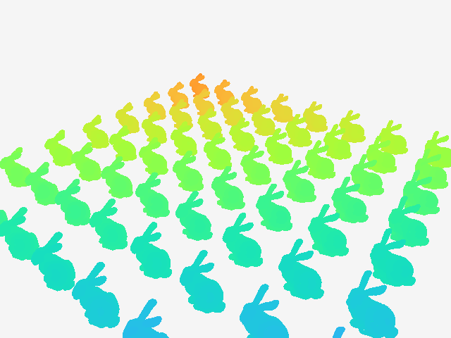

# Stanford point-cloud projections: CPU vs GPU

Render many copies of **Bunny, Dragon, Happy Buddha, or Drill** from a moving camera, then measure the **same K camera poses** on a compiled CPU loop and a CUDA kernel.

[한국어 빠른 시작](README.ko.md) · [Open in Colab](https://colab.research.google.com/github/team-aprl/lecture-RT616-public/blob/main/practice/gpu/bunnys_projections/PointCloud_CPU_GPU.ipynb)



## What you need

- **Python 3.12 (64-bit)** and an up-to-date **NVIDIA driver** for your GPU.
- Windows x64 or Linux x86-64. The tested laptop uses Windows and an RTX 5070 Ti Laptop GPU.
- Internet for Python packages and the first download of each Stanford model.
- Several GB of free disk space for the environment and CUDA wheels.
- AMD/Intel GPUs and Apple GPUs do **not** run this CUDA backend; use CPU mode or Colab.

**Docker is not required.** The installation uses a project-specific virtual environment and CuPy's CUDA component wheels. A separate system CUDA Toolkit, nvcc, Visual Studio, and a C++ compiler are not needed for this RawKernel exercise. The **NVIDIA driver is still required**. See [CuPy's installation guide](https://docs.cupy.dev/en/stable/install.html#installing-cupy-from-pypi). Docker would additionally require GPU passthrough / NVIDIA Container Toolkit; it does not replace the driver.

## Windows: install once, then run

Open PowerShell:

```powershell
git clone https://github.com/team-aprl/lecture-RT616-public.git
cd lecture-RT616-public/practice/gpu/bunnys_projections
nvidia-smi
powershell -NoProfile -ExecutionPolicy Bypass -File .\setup.ps1
powershell -NoProfile -ExecutionPolicy Bypass -File .\run.ps1
```

The execution-policy option applies to that PowerShell process; no permanent policy change is needed. Alternatively, use `py -3.12 setup.py` followed by `py -3.12 run.py`.

On Windows the environment is stored under **%LOCALAPPDATA%/rt616-envs/** with a project-specific key to avoid long CUDA header paths. On Linux it is **.venv/** in this folder. The launchers find it automatically.

Open **http://127.0.0.1:8766/**. The server stays in the terminal; **Ctrl+C** stops it. For later sessions, only run `run.ps1`. Keep this folder as the working directory when invoking Python directly.

## Linux: install once, then run

Install Python 3.12 and its venv support using your distribution's package manager, then:

```bash
git clone https://github.com/team-aprl/lecture-RT616-public.git
cd lecture-RT616-public/practice/gpu/bunnys_projections
nvidia-smi
bash setup.sh
bash run.sh
```

Open **http://127.0.0.1:8766/**. The scripts do not need executable permissions. Linux GPU execution has not been tested on the author's laptop; see [validation](VALIDATION.md).

## Without an NVIDIA GPU

```powershell
# Windows
powershell -NoProfile -ExecutionPolicy Bypass -File .\setup.ps1 -Cpu
powershell -NoProfile -ExecutionPolicy Bypass -File .\run.ps1 -Cpu
```

```bash
# Linux
bash setup.sh --cpu
bash run.sh --cpu
```

CPU mode installs no CuPy/CUDA packages in a fresh environment and disables GPU/Both choices in the viewer. It is a functional fallback, not a GPU comparison.

## Try the experiment

1. Start with **Bunny, Grid 8, Points/model 36000**.
2. Choose **Hover**, **Orbit**, **Dolly**, **Helix**, or **Fly-through**, then press **경로 재생** (play). Drag the image to change angles; use the wheel to approach/retreat.
3. Change Grid to **32** or **64**. These mean 32×32 or 64×64 model instances.
4. Enter **K = 60**, select **Both**, and press **K 프레임 렌더링**.
5. Read the per-frame CPU/GPU ms log and the total, mean, median, p95, and time ratio. **측정 JSON 저장** downloads the measurements.
6. Compare models, point caps (12k / 36k / 100k), and the **GPU 원본+배치 재업로드** option.

GPU batch rendering still processes every sampled point in every instance. Original vertices and instance offsets are stored separately to avoid allocating a huge expanded cloud. The UI reports the actual logical point count; the point cap is deterministic sampling, seed 616. The renderer projects vertices, not filled triangles.

### Console: no viewer needed

```powershell
# Windows; on Linux replace py -3.12 with python3.12
py -3.12 run.py benchmark --frames 60 --grid 32 --model Bunny --path Hover
py -3.12 run.py benchmark --frames 10 --grid 8 --backend CPU --out results/cpu.json
```

For `Happy Buddha`, quote the model name. Add `--upload` to include reupload of the **compact original-plus-offsets** representation.

### What the numbers mean

- **CPU:** Numba-compiled **single-thread** fused projection and z-buffer loop. This is not a comparison with every possible optimized/multithreaded CPU implementation.
- **GPU ms:** pose upload, depth initialization, CUDA kernel, and depth readback to CPU. CuPy's host readback completes the work before the timer stops.
- **K batch:** same poses and points, 3 warmup frames/backend excluded; CPU/GPU order alternates. First and last frame results are checked for matching depth.
- **Total:** sum of measured frame times. **Server wall time** additionally includes validation/logging. Image encoding, transport, and browser display are outside per-frame timings.
- **Viewer ms:** includes request/response and image handling. Colab network latency can dominate. Do not infer GPU speed from the playback FPS.
- Camera depth is **optical-axis Z** in scene units; each model's height is normalized to 1. Empty pixels are light gray.
- The compact reupload experiment differs from copying an expanded 64×64 cloud. It is not a PCIe bandwidth benchmark.
- Benchmarks run on your own hardware. Power mode, battery, thermals, other apps and camera position can change results.

## Colab

The public notebook in this folder contains only this exercise: **① setup → ② viewer**, plus optional **③ console benchmark**. Select a GPU runtime before running. Re-running the viewer cell stops the previous server created by that launcher. Hosted Colab runtime execution has not been independently validated; the notebook's noninteractive cells and server were tested locally.

## Troubleshooting

| Symptom | Action |
|---|---|
| `py` or Python 3.12 not found | Install 64-bit Python 3.12 and its launcher, reopen PowerShell. |
| `nvidia-smi` fails / GPU unavailable | Check the NVIDIA driver; Docker and pip cannot install the host GPU driver. |
| CUDA driver/runtime mismatch or kernel compilation fails | Update the NVIDIA driver for your GPU; run `py -3.12 run.py doctor --require-gpu` (Linux: `python3.12 run.py doctor --require-gpu`). See CuPy's supported-driver guidance. |
| Wrong packages from another environment | Use the supplied launchers; they always select this project's isolated environment. Do not install multiple CuPy variants together. |
| Port 8766 in use | Stop your earlier server, or `run.ps1 -Port 8767` / `bash run.sh --port 8767`. Open the corresponding port. |
| First start takes time | It downloads Bunny and compiles kernels. Setup/warmup is excluded from batch timings. |
| Download fails | Check access to graphics.stanford.edu; remove only the incomplete cached archive, then retry. |
| Colab still shows an old screen | Re-run setup, then the viewer cell. Reload the notebook if its source has changed. |
| 64×64 feels slow | Start at Grid 8 / 12k points and use K batch timings to separate compute from display. |

The server binds **only to 127.0.0.1**; it has no authentication and is not intended as a public web service. The Colab launcher uses Colab's notebook iframe proxy. No telemetry or credentials are included.

## Files and provenance

- `setup.py`, `setup.ps1`, `setup.sh`: isolated installation.
- `run.py`, `runtime_paths.py`, `run.ps1`, `run.sh`, `serve_demo.py`: local viewer and streaming batch log.
- `doctor.py`, `smoke_test.py`: environment report and offline analytic CPU/CUDA correctness check.
- `benchmark.py`, `benchmark_lab.py`: console and shared batch timing logic.
- `stanford_scene.py`, `bunny_depth_lab.py`: models, camera paths, CPU/CUDA projection.
- `colab_live.py`, `PointCloud_CPU_GPU.ipynb`: Colab launcher and standalone notebook.
- `build_notebook.py`: regenerate the notebook after code changes; requires `nbformat`.
- `SOURCES.md`: dataset and implementation references; Stanford archives are downloaded on demand and not redistributed here.
- `VALIDATION.md`: checks performed and platform limits.

Initial public package, September 2026: extracted from the RT616 point-cloud exercise; includes four models, five paths, up to 64×64 instances, live controls and K-frame timing. No Transformer or KV-cache lesson content is included.
